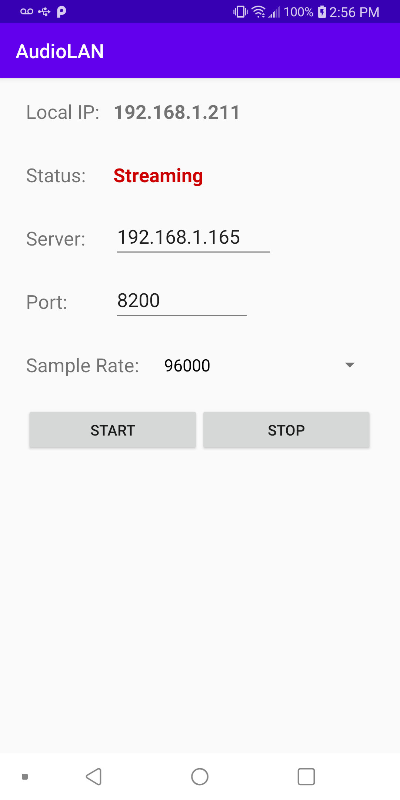

# AudioLAN

Stream microphone from Android device over LAN. The intent is to work with a (python) UDP server that plots the raw audio signal in realtime (server code repo will be posted soon).

On the Android device, proper permissions must be given the app.

